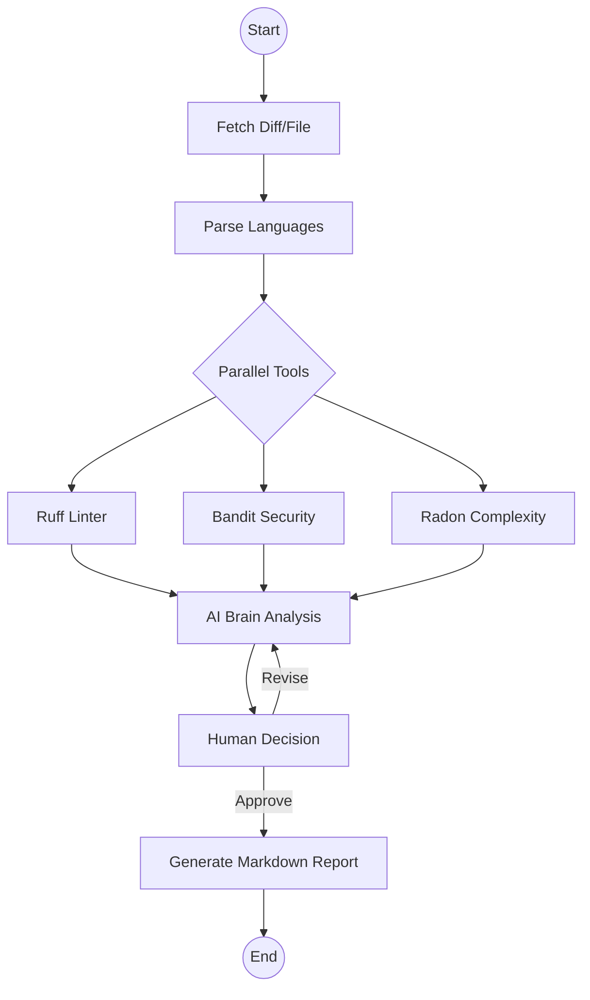

# 🛡️ CodeGuardian

### Multi-Agent AI Code Reviewer

**CodeGuardian** is a premium, agentic AI system designed to automate and elevate the code review process. Built with LangGraph and GPT-4o, it orchestrates multiple specialized agents to perform deep architectural analysis, security auditing, and static linting — all accessible through a glassmorphism dashboard.

Unlike traditional static analysis tools, CodeGuardian combines AI reasoning with industry-standard linters inside an interactive Human-in-the-Loop review pipeline, letting developers collaborate with AI before finalizing code reviews.

It helps developers and engineering teams to:

* 🔍 Perform intelligent, multi-agent code reviews
* 🛡️ Detect security vulnerabilities automatically
* 🏗️ Analyze architectural quality
* 📊 Measure code complexity
* 🤖 Receive AI-powered improvement suggestions
* 👨‍💻 Collaborate with AI through Human-in-the-Loop review

---

# 🚀 Features

## 🤖 Multi-Agent Orchestration

✅ Specialized agents for Linting, Security, Complexity, and Architectural review

✅ Customizable reviewer personalities: "The Architect", "The Security Auditor", "The Junior Mentor"

✅ Parallel tool execution for faster analysis

---

## 🎨 Premium Dashboard

✅ Real-time Mermaid graph visualization of the live agentic workflow

✅ High-end Streamlit UI with glassmorphism design

✅ Interactive progress tracking

---

## 🔄 Human-in-the-Loop (HITL)

✅ Pause the AI to provide feedback

✅ Request revisions before finalizing

✅ Approve the final report

---

## 🌍 Universal Support

✅ GitHub Pull Request reviews

✅ Direct code snippet analysis

✅ Multi-language file uploads

---

# 🏗️ System Architecture



---

# 🛠️ Tech Stack

## Backend

* Python
* LangGraph
* PyGithub

## AI

* OpenAI GPT-4o
* Multi-Agent Architecture

## Static Analysis

* Ruff
* Bandit
* Radon

## Frontend

* Streamlit

---

# 📂 Project Structure

```text
CodeGuardian/
│
├── agents/
│   ├── architecture/
│   ├── security/
│   ├── quality/
│   ├── complexity/
│   └── orchestrator/
│
├── dashboard/
│   ├── components/
│   ├── styles/
│   └── app.py
│
├── services/
├── github/
├── prompts/
├── utils/
├── tests/
│
├── requirements.txt
├── README.md
└── .env
```

---

# 🎯 How It Works

### 1️⃣ Select Review Source

Developers choose a GitHub Pull Request, local source code, or a code snippet.

↓

### 2️⃣ Code Parsing

The system detects programming languages, project structure, and relevant files.

↓

### 3️⃣ Multi-Agent Review

Specialized AI agents analyze the project in parallel — Architecture, Security, Quality, Complexity.

↓

### 4️⃣ Static Analysis

Ruff, Bandit, and Radon perform additional automated validation.

↓

### 5️⃣ Human-in-the-Loop Review

Developers approve results, request revisions, or provide feedback.

↓

### 6️⃣ Report Generation

A professional Markdown report is generated with findings and recommendations.

↓

### 7️⃣ Export & Share

Reports can be exported or integrated into GitHub workflows.

---

# 📊 Example Workflow

```text
Developer
      │
      ▼
Select Repository / Snippet
      │
      ▼
Parse Source Code
      │
      ▼
Multi-Agent Analysis
      │
      ▼
Static Analysis (Ruff / Bandit / Radon)
      │
      ▼
Human Review
      │
      ▼
AI Report Generation
      │
      ▼
GitHub / Export
```

---

# 💡 Future Improvements

* GitHub Actions Integration
* GitLab & Bitbucket Support
* Docker & Kubernetes Manifest Review
* CI/CD Pipeline Integration
* Automated Pull Request Comments
* Team Collaboration Dashboard
* Code Review History & Analytics

---

# 🧑‍💻 Author

**Hoor Shumail**

AI | Machine Learning | Agentic AI | Multi-Agent Systems | Software Engineering

---

# 📜 License

This project is developed for educational, research, and portfolio purposes.
